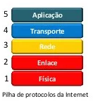

# Trabalho avaliativo de MATA59 - Redes de Computadores
### Álvaro Oliveira, Caio Santos, Carlos Neto e Vanessa Araújo.

## ARQUITETURA CLIENTE-SERVIDOR:

A arquitetura cliente servidor, que é o ponta pé inicial para o desenvolvimento do nosso projeto. 

Há um hospedeiro sempre em funcionamento, denominado servidor, que atende a requisições de muitos outros hospedeiros, denominados clientes. Seguindo os padrões desta arquitetura, não há comunicação direta entre os clientes. O servidor tem um endereço fixo, bem conhecido, o endereço IP. Por causa dessa característica do servidor e pelo fato de ele estar sempre em funcionamento, um cliente sempre pode contatá-lo.

### SERVIDOR:
É responsável pelo provimento do serviço, está sempre ligado e possui endereço de IP permanente, isso pela necessidade de ser conhecido por todos os clientes para fazer suas requisições.

### CLIENTE:
Busca o serviço oferecido pelo servidor. Comunica-se com o servidor e pode estar conectado intermitentemente (Entrar e sair da rede sem nenhum problema). Pode ter endereços IP dinâmicos e não se comunica diretamente com outros clientes;

## PILHA TCP/IP

 

## CAMADA DE APLICAÇÃO: 

Contamos com duas aplicações: uma para o cliente e outra para o servidor. A classe FileClient  e a classe FileServer respectivamente. Ambas aplicações não terão interface gráfica.  

No servidor terá um critério de aceitação da conexão iniciada pelo cliente. 

Nessa camada, o arquivo e suas informações serão empacotadas e repassadas à camada de transporte, que fará seu envio.  

Por conta do envio e recebimento de arquivos entre a rede, através do Client e do Server, temos a simulação de um protocolo FTP, que tem por função fazer o envio e recebimento de arquivos entre duas aplicações. 

## CAMADA DE TRANSPORTE: 

Simulando a camada de transporte, a qual deve realizar o transporte de dados entre sistemas finais, temos na classe FileServer, a criação do socket passando IP de destino e porta de entrada, há uma tentativa de conexão, ou seja, é responsável por fazer a ligação entre a camada de aplicação e a camada de rede (responsável por aceitar ou não essa conexão. 

Na nossa aplicação fazemos o uso do protocolo de transporte FTP pelo fato de nossa aplicação fazer transporte de arquivos de texto, os quais não podemos tolerar perdas, pois desejamos que este tipo de arquivo não sofra perdas neste processo. Este protocolo está encapsulado nas bibliotecas usadas pelo Socket. 

## CAMADA DE REDE: 

Sabendo que a camada de rede é responsável por roteamento e repasse de dados além de estabelecimento de conexão, simulamos a camada de rede utilizando as bibliotecas JAVA java.net.socket e java.net.ServerSocket. A partir delas utilizamos o objeto ServerSocket que tem como parâmetro a porta a ser utilizada, definida ao executar o servidor. Como o próprio nome já intui, esta é responsável por aceitar ou recusar as conexões propostas pela aplicação cliente. 

O cliente, então, pode utilizar a classe de socket, junto da porta e o IP de destino, permitindo uma comunicação bidirecional entre processos. Ou seja, vai existir um socket datagrama contendo endereço de IP e porta de destino final, utilizando funções da própria biblioteca citada, para enviar e receber esses pacotes para e das camadas inferiores. 

## CAMADA DE ENLACE: 

A camada de enlace fica encapsulada com a camada física e isso tudo é simulado através do uso dos Sockets que nossa aplicação utiliza. 

## CAMADA FÍSICA:

A camada física será simulada através de sockets, utilizando as bibliotecas JAVA <java.net.socket> e <java.net.ServerSocket> com datagramas. Esse método, bem como a camada física real, não garante confiabilidade dos dados. 

## RODANDO A APLICAÇÃO: 

Para rodar a aplicação, primeiro deve-se executar a classe FileServer e selecionar uma porta de sua preferência. Feito isso, o servidor irá estar pronto para receber conexões e ficará no estado aguardando.

Agora, pode-se executar a classe FileClient. Nela, deve ser passado o ip do servidor (Ex: O IPV4 do Adaptador Ethernet), a porta utilizada na inicialização do FileServer e o nome do cliente. A partir daí, se possível, a conexão vai ser feita com o servidor e vai ser apresentado na tela do cliente todos os arquivos associados com o nome do cliente, caso haja. A partir desse momento, 4 opções podem ser escolhidas correspondentes a cada funcionalidade da aplicação:
1. Upload de um arquivo. Nessa funcionalidade, o cliente passa o nome do arquivo a ser salvo, o nível de tolerância a falhas e o path para o arquivo existente na máquina do cliente. O servidor então irá pegar essas informações e guardar n cópias desse arquivo, onde o número de cópias é relacionado ao nível de tolerância a falhas.
2. Download de um arquivo. Nessa funcionalidade, o cliente passa o nome do arquivo salvo no servidor que deseja baixar e passa o path onde deseja salvar na sua máquina. O servidor então procura uma cópia desse arquivo e caso encontre, envia os dados desse arquivo em forma de bytearray para ser salvo na máquina do cliente.
3. Remoção de um arquivo. Nessa funcionalidade, o cliente passa o nome do arquivo salvo no servidor que deseja remover. O servidor então percorre em todas as suas máquinas e vai removendo cada cópia desse arquivo do servidor.
4. Alterar nível de tolerância a falhas. Nessa funcionalidade, o cliente passa o nome do arquivo salvo no servidor que vai ter o nível de tolerância alterado e o novo nível de tolerância. Caso o nível tenha diminuido, o servidor percorre suas máquinas removendo a quantidade necessária de cópias até atingir o nível desejado. Caso o nível tenha aumentado, o servidor percorre suas máquinas e adiciona a quantidade necessária de cópias até atingir o nível desejado.
5. Existe uma funcionalidade implícita, que é a listagem de arquivos do cliente. Ao digitar o nome do cliente na inicialização, o FileClient envia para o FileServer essa informação e retorna uma lista de nome de arquivos existentes para aquele cliente correspondente.

## OBSERVAÇÕES: 

Nosso programa é sensível a falhas, porém, qualquer problema que houver com o arquivo e o carregamento do mesmo em memória, a JVM detectará uma “exception”, o que garantirá que o problema irá ser detectado no log do programa. 
